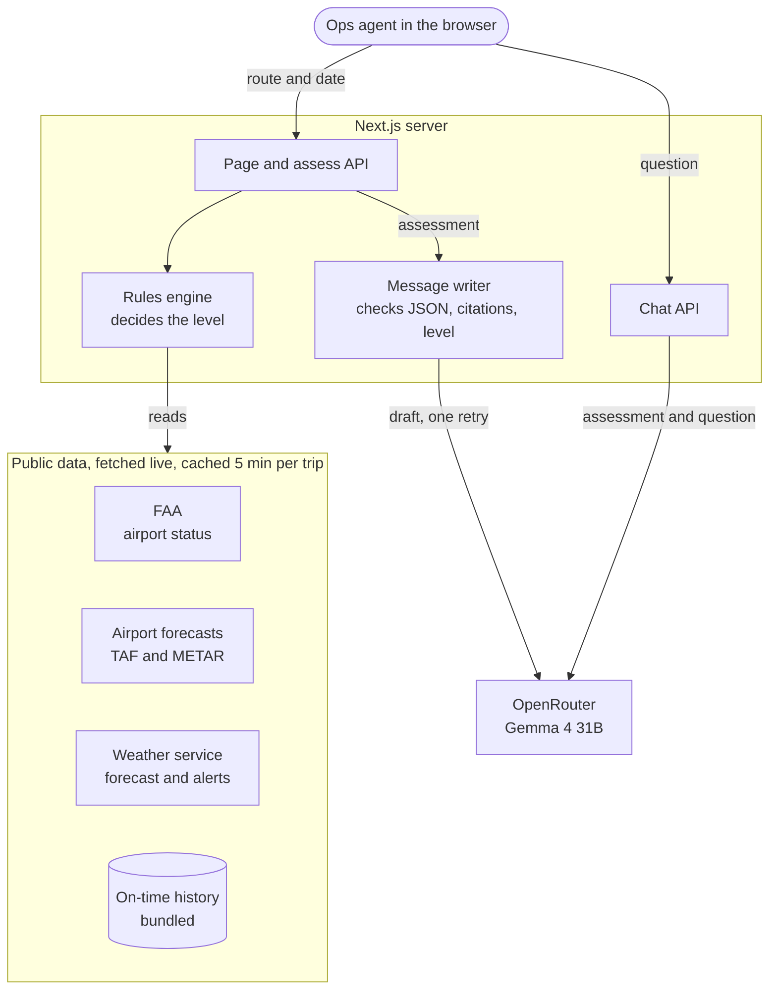

# Trip check

Type a U.S. route and a date. Trip check tells you how likely the trip is to be disrupted, why, and what to do about it.

It's built for an Operations team that looks after employees on the road. You get a risk level (Low, Moderate, High or Severe), the facts behind it with a link to each source, a short checklist, nearby airports worth considering, a ready-to-send message for the traveler, and a chat to ask questions about that one trip.

Every number comes from live public data. Nothing is made up and nothing is paid for.

## How it decides

Plain rules set the risk level, not the AI. They read these public sources and keep the worst problem they find:

| Source | What it says | How far ahead |
|---|---|---|
| FAA airport status | Ground stops, ground delays, closures | Today only |
| Airport forecasts (TAF) and observations (METAR) | Wind, gusts, low cloud, storms, snow | About 30 hours |
| National Weather Service | 7-day forecast and active warnings | About 7 days |
| U.S. DOT on-time history | How often this route runs late in this month | Any date |

The further out the date, the fewer sources can speak, and the page says so. Three weeks out you get history only and a date to check again.

## Where the AI fits

The AI writes the traveler message and answers the chat. It runs on [OpenRouter](https://openrouter.ai) with Google's free `google/gemma-4-31b-it:free` model.

The model only sees what the rules produced. It must cite the evidence it uses, and it can't change the risk level. The server checks each message before showing it: malformed JSON, an invented citation or a different level gets the draft rejected, with one retry. Stray markdown in chat answers is turned into clean paragraphs and lists.

Without a key, everything else still works and the page says the AI parts are off.

## System design



A check goes like this:

1. The route and date go into the URL, so any check can be shared as a link.
2. The server fetches the live sources in parallel and caches the result for 5 minutes, so the page, the API and the chat all see the same data.
3. The rules turn that data into a level, the evidence behind it and a checklist. The page shows this right away and doesn't wait for the AI.
4. The model receives the rules' output, never the raw feeds, and writes the traveler message. The checker rejects any draft that breaks the rules, with one retry.
5. The chat sends the same assessment plus the question, and the answer streams back.

Delivery follows the same idea: every push to `main` runs the checks in GitHub Actions, builds the Docker image and publishes it to the GitHub Container Registry.

## Run it

You need [Bun](https://bun.sh) 1.3 and an OpenRouter key (free at [openrouter.ai/keys](https://openrouter.ai/keys)).

```bash
cp .env.example .env.local   # put your key in OPENROUTER_API_KEY
bun install
bun run dev                  # http://localhost:3000
```

To check the AI end to end against a running server:

```bash
bun run smoke:ai http://localhost:3000
```

## Docker

```bash
docker build -t trip-check .
docker run --rm -p 3000:3000 --env-file .env.local trip-check
```

CI publishes the image to the GitHub Container Registry on every push to `main`. The repository is private, so log in first:

```bash
docker login ghcr.io
docker run --rm -p 3000:3000 -e OPENROUTER_API_KEY=your-key ghcr.io/sheicky/red-take-home:latest
```

## Configuration

| Variable | Where to set it | Default |
|---|---|---|
| `OPENROUTER_API_KEY` | `.env.local`, and the GitHub secret of the same name for CI | none |
| `OPENROUTER_MODEL` | `.env.local`, and the GitHub variable of the same name | `google/gemma-4-31b-it:free` |
| `OPENROUTER_BASE_URL` | `.env.local` | `https://openrouter.ai/api/v1` |
| `NWS_USER_AGENT` | `.env.local` (the weather service asks for a contact) | a generic string |

The key stays on the server. It never reaches the browser, and `scripts/make_zip.sh` refuses to package anything that looks like one.

## Tests and CI

```bash
bun run test        # unit tests, AI calls mocked
bun run lint
bun run typecheck
```

GitHub Actions runs lint, types, tests and a production build on every push. Then it builds the Docker image, starts it and checks the home page and the API. When the `OPENROUTER_API_KEY` secret is set, one more job asks the real model for a message and a chat answer.

## Tech stack

- Next.js 16 (App Router, streaming with Suspense) and React 19
- TypeScript and Tailwind CSS 4
- Bun for installs and scripts, Vitest for tests
- OpenRouter for the AI, Gemma 4 31B by default
- Docker on Node 24, GitHub Actions, GitHub Container Registry

## Layout

```
src/app            the page and the API routes (/api/assess, /api/chat, /api/airports)
src/lib            sources, rules, the assessment, and the AI in src/lib/ai
src/components     the result page
data               airports and on-time history, built by scripts/
```
